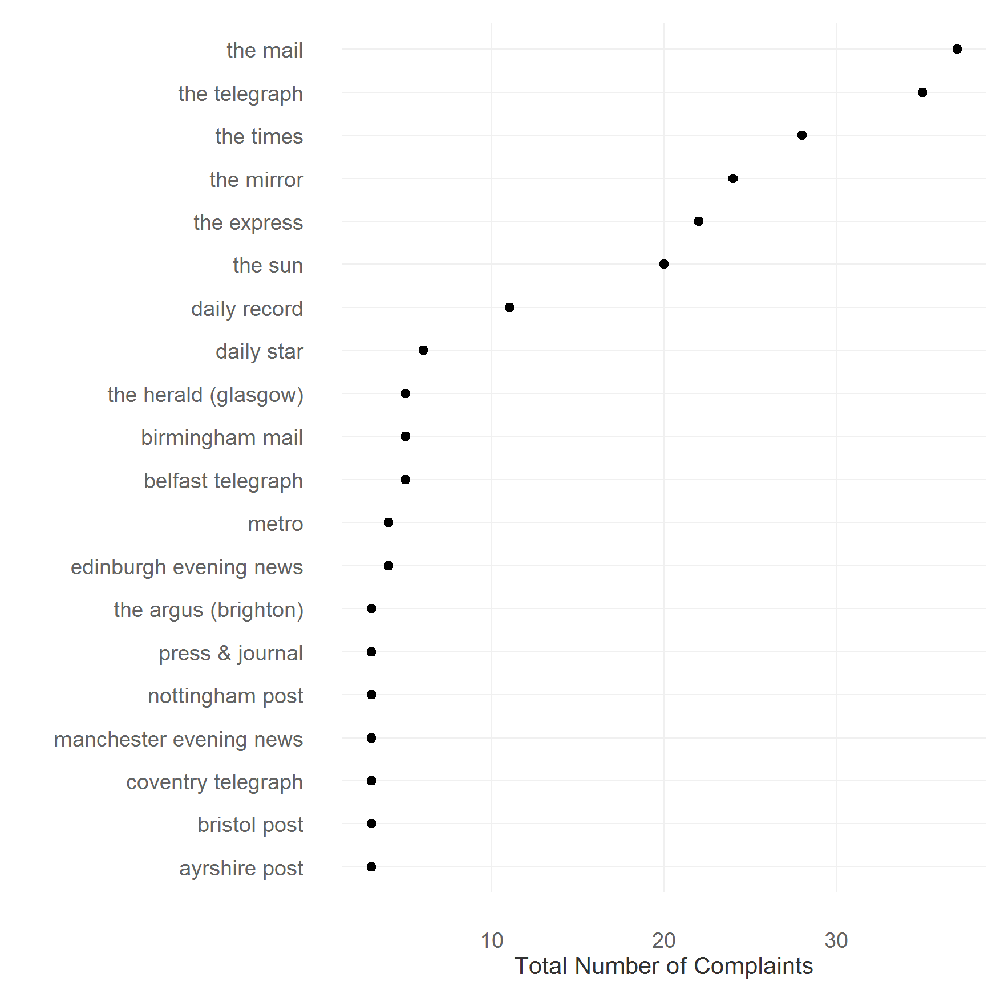
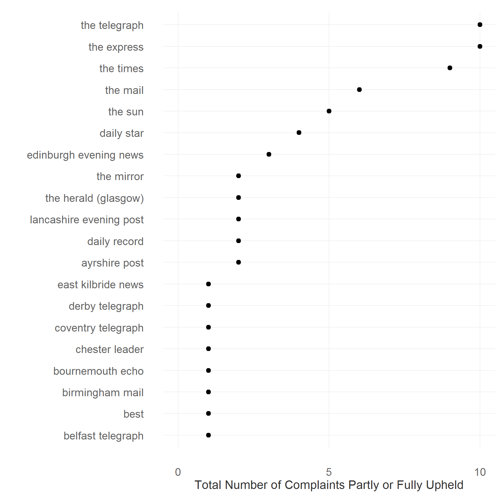

## Analysis of IPSO Complaints

[Independent Press Standards Agency (IPSO)](https://www.ipso.co.uk/IPSO/index.html) handles complaints about accuracy etc. in the media. Here, I analyze the complaints received by IPSO. 

IPSO has received 371 complaints as of May 20th, 2016. Of the 371 complaints, [The Telegraph](http://www.telegraph.co.uk/) alone received 35 complaints, or about 9.4% of the total complaints. It was followed closely by [The Mail](http://www.dailymail.co.uk/), with 31 complaints. [The Times](http://www.thetimes.co.uk/) had 25 complaints filed against it, [The Mirror](http://www.mirror.co.uk/) and [The Express](http://www.express.co.uk/) 22 each and [The Sun](http://www.thesun.co.uk/sol/homepage/), 19 complaints. 

However, generally less than half the number of complaints were completely or partly upheld. Topping the list was [The Express](http://www.express.co.uk/) and [The Telegraph](http://www.telegraph.co.uk/) with 10 upheld complaints each. And following close behind was [The Times](http://www.thetimes.co.uk/) with 8 complaints, [The Mail](http://www.dailymail.co.uk/) with 6, and the [The Sun](http://www.thesun.co.uk/sol/homepage/) and the Daily Star with 4 each. 

See also [plot (png)](figure/batting_av-1.png) of batting average of media organizations with most complaints against them.

---------------

**Table of Contents:**

* [Data](data/ipso_complaints.csv)  
* [Script](ipso_facto.R)  
* Figures:  
  * [Total Complaints (pdf)](figs/ipso_n_complaints.pdf)  
  * [Total Complaints Upheld (pdf)](figs/ipso_n_upheld.pdf)  
  * [Batting Average (pdf)](figs/ipso_p_upheld.pdf)  

