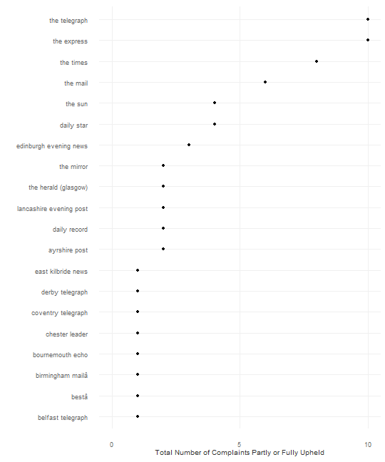
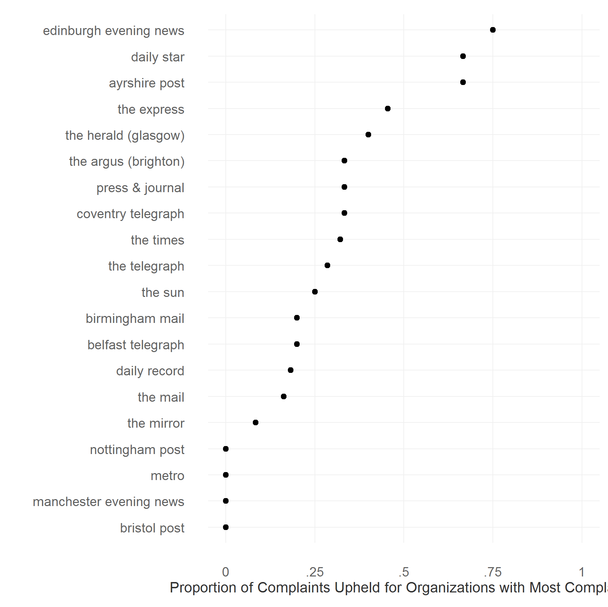

## Analysis of IPSO Complaints

[Independent Press Standards Agency (IPSO)](https://www.ipso.co.uk/IPSO/index.html) handles complaints about accuracy etc. in the media. Here, I analyze the complaints received by IPSO. 

IPSO has received 371 complaints as of May 20th, 2016. Of the 371 complaints, [The Telegraph](http://www.telegraph.co.uk/) alone received 35 complaints, or about 9.4% of the total complaints. It was followed closely by [The Mail](http://www.dailymail.co.uk/), with 31 complaints. [The Times](http://www.thetimes.co.uk/) had 25 complaints filed against it, [The Mirror](http://www.mirror.co.uk/) and [The Express](http://www.express.co.uk/) 22 each and [The Sun](http://www.thesun.co.uk/sol/homepage/), 19 complaints. ([Plot (pdf)](figure/ipso_n_complaints.pdf) of total complaints for top 20 media organizations with most complaints against them.) 

However, generally less than half the number of complaints were completely or partly upheld. Topping the list was [The Express]((http://www.express.co.uk/) and [The Telegraph](http://www.telegraph.co.uk/) with 10 upheld complaints each. And following close behind was [The Times](http://www.thetimes.co.uk/) with 8 complaints, [The Mail](http://www.dailymail.co.uk/) with 6, and the [The Sun](http://www.thesun.co.uk/sol/homepage/) and the Daily Star with 4 each. ([Plot (pdf)](figure/ipso_n_upheld.pdf) of total upheld complaints for top 20 media organizations with most upheld complaints against them.) See also [plot (pdf)](figure/ipso_p_upheld.pdf) of batting average of media organizations with most complaints against them.

-----------------------


```r
# set dir
setwd(githubdir)
setwd("ipso_facto/")
```

### Scrape IPSO 


```r
# Scrape IPSO
library(rvest)
library(stringi)
ipso <- read_html("https://www.ipso.co.uk/IPSO/rulings/IPSOrulings.html")

tabs <- 
  ipso %>% 
  html_nodes("table") %>%
  html_table(header=T)
```

### Clean the data


```r
tab <- tabs[[1]]

tab[,1] <- gsub("Â|â€|™|“ ", "", tab[,1])

tab$media_org <- sapply(strsplit(tab[,1], "\\sv\\s"), "[", 2)
tab$media_org <- sapply(strsplit(tab$media_org, "\\["), "[", 1) 
tab$media_org <- gsub("Â|\r\n", "", tab$media_org) 
tab$media_org <- gsub("\\s+$", "", tab$media_org) # remove trailing space
tab$media_org <- tolower(tab$media_org)

# Standardizing media:
tab$media_org[grepl("daily star|dailystar", tab$media_org)] <- "daily star"
tab$media_org[grepl("the sun |the sun$", tab$media_org)] <- "the sun"
tab$media_org[grepl("the daily telegraph|the sunday telegraph|telegraph.co.uk", tab$media_org)] <- "the telegraph"
tab$media_org[grepl("the times$|the sunday times$", tab$media_org)] <- "the times"
tab$media_org[grepl("daily mail$|the mail on sunday|mail online|mail online|sunday mail|the mail$", tab$media_org)] <- "the mail"
tab$media_org[grepl("daily mirror$|mirror.co.uk|sunday mirror$", tab$media_org)] <- "the mirror"
tab$media_org[grepl("daily express$|express.co.uk|sunday express$", tab$media_org)] <- "the express"

# Appeal held/in part
tab$Upheld[grepl("was not upheld", tab$Conclusions)] <- 0
tab$Upheld[grepl("was upheld", tab$Conclusions)] <- 1
# write.csv(tab, file="data/ipso_complaints.csv", row.names=F)
```

### Calculate Basic Stats

```r
# Batting average
library(plyr)
upheld_tab <- ddply(tab, ~media_org, summarise, total_complaints=length(media_org), total_upheld = sum(Upheld))
upheld_tab$prop_upheld <- upheld_tab$total_upheld/upheld_tab$total_complaints
upheld_tab <- subset(upheld_tab, !is.na(prop_upheld))

# Plot top 20
media_tab <- table(tab$media_org)
media_tab2 <- setNames(data.frame(media_tab[order(-media_tab)][1:20]), c("Media", "Frequency"))
media_tab2$Media <- factor(media_tab2$Media, levels=media_tab2$Media[order(media_tab2$Frequency)], ordered=TRUE) #reordering
```

To download the data, [click here](data/ipso_complaints.csv).

### Total Complaints Received


```r
# The plot
library(ggplot2)
library(scales)
library(grid)

ggplot(media_tab2, aes(Frequency, Media)) +
geom_point() + 
ylab("") + 
xlab("Total Number of Complaints") + 
theme_minimal(base_size=9) +
theme(panel.grid.major=element_line(color="#F0F0F0",size=.25)) +
theme(panel.grid.minor=element_blank()) +
theme(axis.ticks=element_blank()) +
theme(legend.position="none") +
theme(plot.title=element_text(color="#525252", size=10, vjust=1.25)) +
theme(axis.text.x=element_text(size=7, color="#636363")) +
theme(axis.text.y=element_text(size=7, color="#636363")) +
theme(axis.title.x=element_text(size=8, color="#323232", vjust=0)) +
theme(axis.title.y=element_text(size=8, color="#323232", vjust=1.25)) +
theme(plot.margin = unit(c(0.35, 0.2, 0.3, 0.35), "cm"))
```


```r
#ggsave("figure/ipso_n_complaints.pdf")
```

To download the pdf version of the graph, [click here](figure/ipso_n_complaints.pdf).


### Total Complaints Upheld 


```r
n_upheld <- setNames(upheld_tab[order(-upheld_tab$total_upheld)[1:20],c("media_org", "total_upheld")], c("Media", "Frequency"))
n_upheld$Media <- factor(n_upheld$Media, levels=n_upheld$Media[order(n_upheld$Frequency)], ordered=TRUE) #reordering

ggplot(n_upheld, aes(Frequency, Media)) +
geom_point() + 
theme_minimal(base_size=9) +
ylab("") + 
xlab("Total Number of Complaints Partly or Fully Upheld") + 
scale_x_continuous(limits=c(0, 10), breaks = c(0,5,10), labels = c("0", "5", "10")) + 
theme(panel.grid.major=element_line(color="#F0F0F0",size=.25)) +
theme(panel.grid.minor=element_blank()) +
theme(axis.ticks=element_blank()) +
theme(legend.position="none") +
theme(plot.title=element_text(color="#525252", size=10, vjust=1.25)) +
theme(axis.text.x=element_text(size=7, color="#636363")) +
theme(axis.text.y=element_text(size=7, color="#636363")) +
theme(axis.title.x=element_text(size=8, color="#323232", vjust=0)) +
theme(axis.title.y=element_text(size=8, color="#323232", vjust=1.25)) +
theme(plot.margin = unit(c(0.35, 0.2, 0.3, 0.35), "cm"))
```



```r
#ggsave("figure/ipso_n_upheld.pdf")
```
To download the pdf version of the graph, [click here](figure/ipso_n_upheld.pdf).

### Batting Average of Media Organizations with most complaints against them


```r
# Batting average of the top 20

p_upheld    <-  setNames(upheld_tab[upheld_tab$media_org %in% media_tab2$Media, c("media_org", "total_upheld")], c("Media", "Proportion"))
p_upheld$Media <- factor(p_upheld$Media, levels=p_upheld$Media[order(p_upheld$Proportion)], ordered=TRUE) #reordering

ggplot(p_upheld, aes(Proportion, Media)) +
geom_point() + 
theme_minimal(base_size=9) +
ylab("") + 
xlab("Proportion of Complaints Upheld for Organizations with Most Complaints") + 
scale_x_continuous(limits=c(0, 10), breaks = c(0,5,10), labels = c("0", "5", "10")) + 
theme(panel.grid.major=element_line(color="#F0F0F0",size=.25)) +
theme(panel.grid.minor=element_blank()) +
theme(axis.ticks=element_blank()) +
theme(legend.position="none") +
theme(plot.title=element_text(color="#525252", size=10, vjust=1.25)) +
theme(axis.text.x=element_text(size=7, color="#636363")) +
theme(axis.text.y=element_text(size=7, color="#636363")) +
theme(axis.title.x=element_text(size=8, color="#323232", vjust=0)) +
theme(axis.title.y=element_text(size=8, color="#323232", vjust=1.25)) +
theme(plot.margin = unit(c(0.35, 0.2, 0.3, 0.35), "cm"))
```



```r
#ggsave("figure/ipso_p_upheld.pdf")
```
To download the pdf version of the graph, [click here](figure/ipso_p_upheld.pdf).
